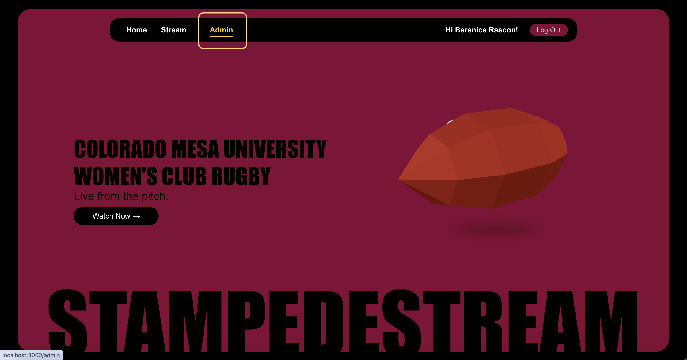
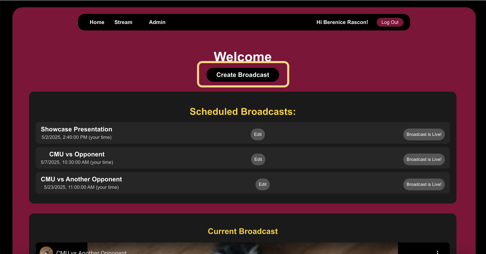
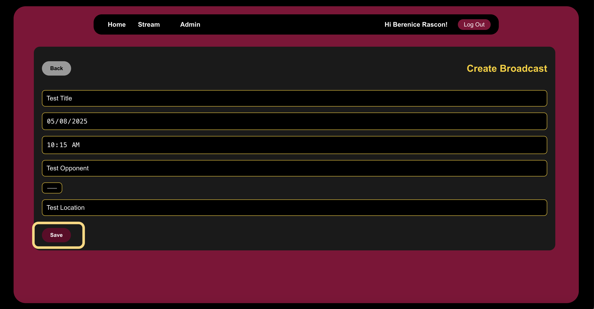
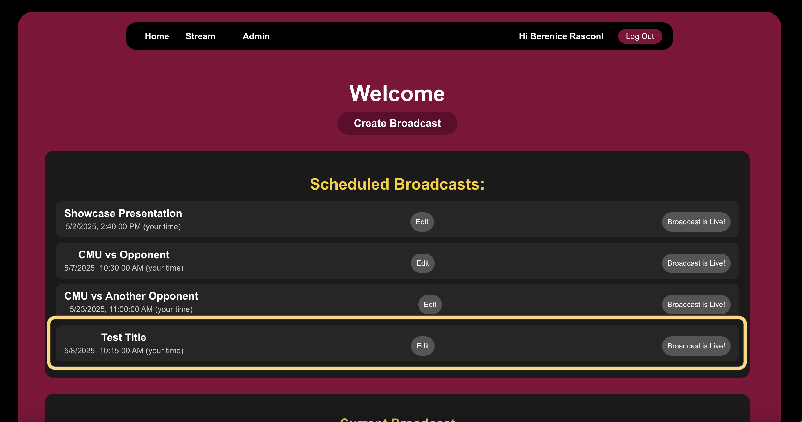
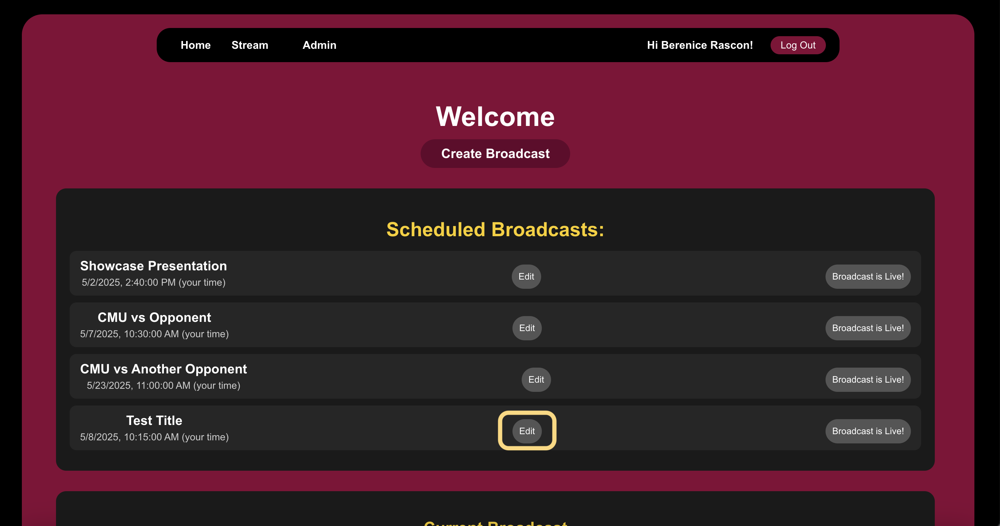

# 🎦 How to create, edit, and remove a live stream broadcast using StampedeStream 

## To CREATE a live stream broadcast 

1. Open the StampedeStream site using your device.
2. Login to an Admin account. 
3. Click "Admin" in the upper nav bar to open the Admin page.
    
4. Click "Create Broadcast".
    
5. In the Broadcasts page, complete all entries for your upcoming game. 
6. Once all entries are completed, click "Save" to save the broadcast.
    
7. Once saved, you will be redirected back to the Broadcasts page.
8. Verify that your broadcast, containg correct game information is listed in the "Scheduled Broadcasts" window.
    

## To EDIT a live stream broadcast

9. Follow steps 1-3 to access the StampedeStream Admin page.
10. In the Scheduled Broadcasts window, identify the broadcast you would like to Edit
11. Click "Edit"
    
12. 

## To REMOVE a live stream broadcast