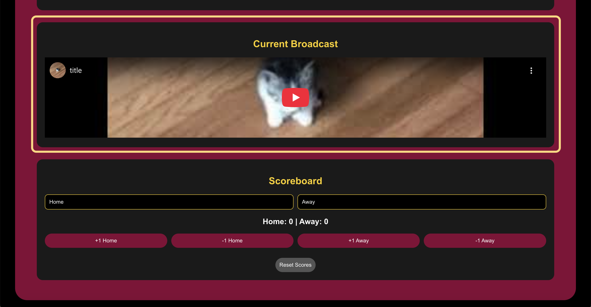
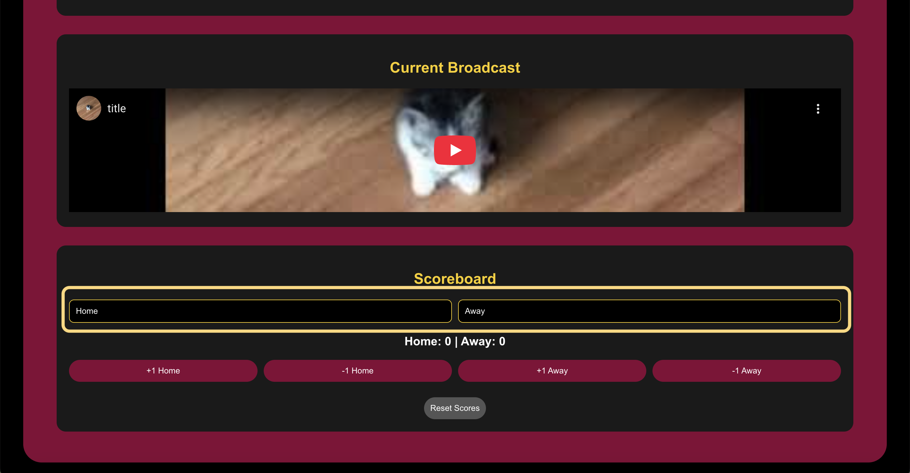
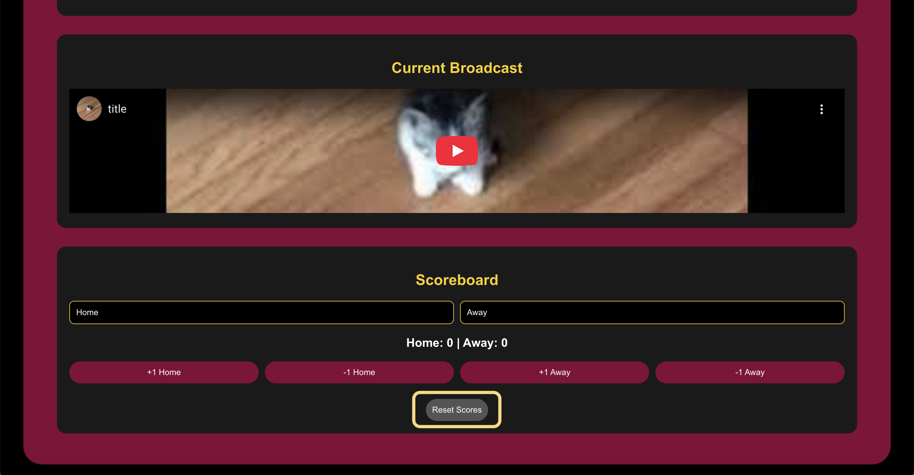

# 🎦 How To Manage A Live Stream Using StampedeStream 

1. Open the StampedeStream site using a separate device from the one that is recording
2. Login to an Admin account 
3. Open the Admin page 
4. [Create a new broadcast](./Create,Edit,RemoveBroadcasts.md) or identify an existing broadcast in the admin page
5. On the designated recording device, follow steps 1-23 from the [Using Stream Labs Guide](./UsingStreamLabs.md) to begin your live broadcast
6. Once your broadcast is LIVE, verify that you can watch on the StampedeStream Admin page under "Current Broadcast"
     
7. In the "Scoreboard" window, you may edit the school names under "Home" and "Away"
    
8. Click "Reset Scores" to ensure that the scores are reset to [0-0] at the beginning of the broadcast
    
9. As the managing viewer is watching the broadcast, they may add and deduct points live from both teams. These scores are reflected in the Stream page of StampedeStream for fans watching
    

## 🔴 At The End of a Broadcast
10. On your designated recording device, follow steps 24-26 of the [Using Stream Labs Guide](./UsingStreamLabs.md) to end your live broadcast
11. On the managing device, click "Reset Scores" once again
12. If "Home" and "Away" team names were updated, reset them back to "Home" and "Away"
