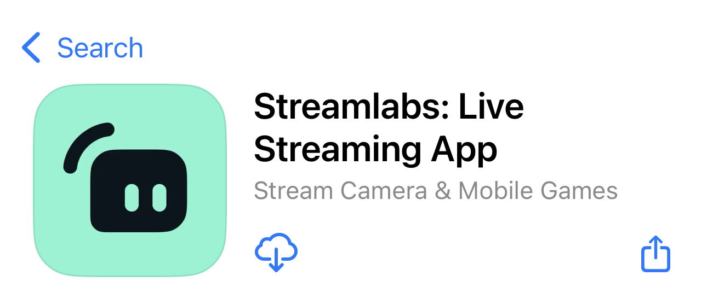

# 📱 How to use the StreamLabs app for your livestream
 
1. On your mobile device, download the "Streamlabs" app from the Apple App Store or Google Play Store
    
2. Open the Streamlabs app
3. In the login page, select YouTube to login with a platform
    
4. Select "Continue" to allow the app access to your Admin Google account
    
5. Select the correct Admin Google account to login
    
6. You may choose to enable/ disable notifications from Streamlabs to your device
7. Allow Streamlabs to access the device's camera
    
8. Allow Streamlabs to access the device's microphone
    
9. Once you are logged into Streamlabs, follow the step-by-step tutorial provided by the app.
10. To create, edit, and delete broadcasts, follow this guide: 
[Create, Edit, and Remove Broadcasts Guide](../Create,Edit,RemoveBroadcasts.md)

## 🟢 When You Are Ready to Start Streaming:
11. Make sure Orientation Lock is Disabled on your device's settings. 
    
12. Rotate your device to Landscape Mode
13. Click "GO LIVE" on the bottom of the Streamlabs page
    
14. Select "Camera" and click "Next"
    
15. Under YouTube, verify the correct Admin account is selected
    
16. Click the "New Broadcast" dropdown 
    
17. Click "Upcoming Event" - This will list all upcoming broadcsts that were created on the StampedeStream App
    
18. Select the desired scheduled broadcast
19. Verify the correct broadcast is selected
20. Click "Next"
    
21. You may add additional information to your broadcast: Description, Thumbnail, etc.
22. Scroll to the bottom and click "GO LIVE"
    
23. You will now be broadcasting live to StampedeStream!
    
## 🔴 Ending the Live Stream:
24. Click "Stop" at the bottom of the Streamlabs page
    
25. Click "STOP" to confirm
    
26. Your live stream will end and will be saved onto your admin YouTube account

